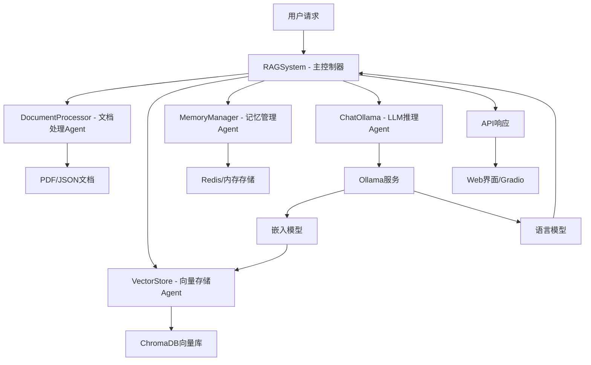
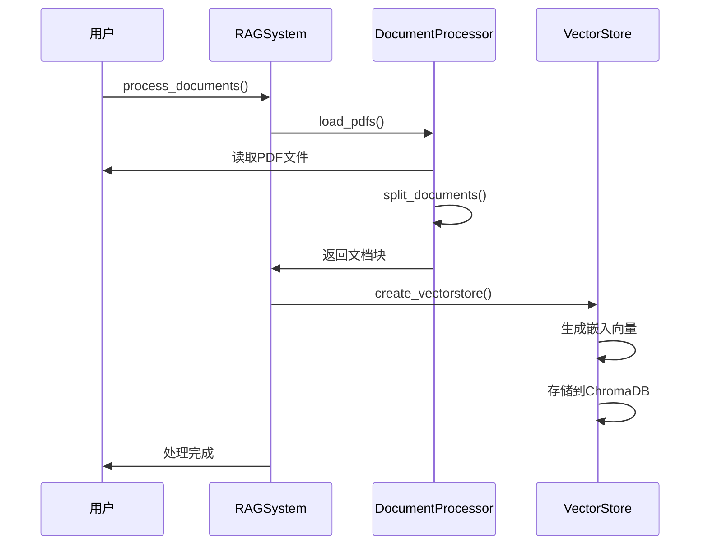
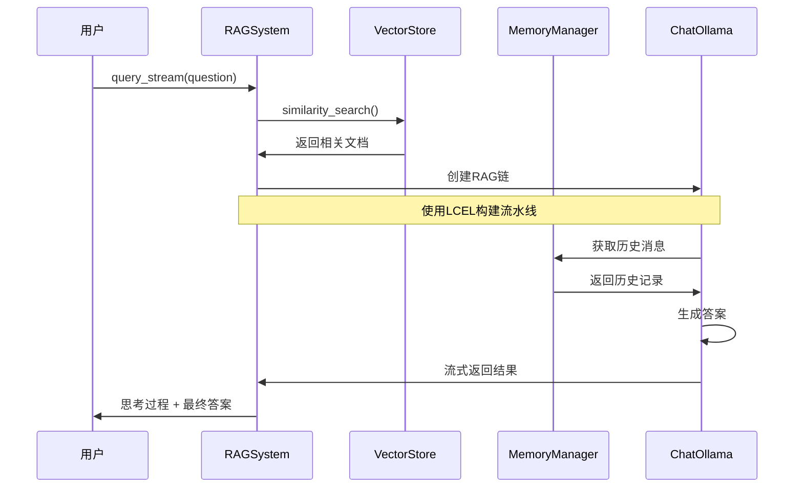

# 多智能体RAG系统深度学习文档

## 1. 系统概述

本系统是一个基于 **LangChain** 构建的 **RAG（检索增强生成）系统**，专门用于高光谱图像显著目标检测领域的智能问答。该系统通过多个智能Agent协同工作，实现了文档处理、向量存储、记忆管理和智能问答等功能。

## 2. 系统架构概览

### 2.1 整体架构图



### 2.2 Agent关系分析

该系统采用**层次化管理 + 顺序协作**的混合架构：

- **主控层**: RAGSystem作为中央控制器，负责协调各子Agent
- **执行层**: 各专业Agent独立处理特定任务
- **状态层**: MemoryManager提供跨Agent的状态共享机制
- **存储层**: VectorStore和MemoryManager分别处理长期和短期记忆

## 3. 核心组件详解

### 3.1 RAGSystem - 主控制器

```python
class RAGSystem:
    def __init__(self, session_id: str = None, use_redis: bool = None):
        self.memory_manager = get_memory_manager(session_id, use_redis)
        self.vector_store = VectorStore(...)
        self.processor = DocumentProcessor(...)
        self.llm = ChatOllama(...)
```

**职责**：
- 初始化和协调所有子系统
- 创建LangChain LCEL（LangChain Expression Language）流水线
- 管理会话状态和生命周期
- 提供统一的API接口

### 3.2 DocumentProcessor - 文档处理Agent

```python
class DocumentProcessor:
    def __init__(self, chunk_size: int = 500, chunk_overlap: int = 50):
        self.text_splitter = RecursiveCharacterTextSplitter(...)
```

**职责**：
- 加载PDF和JSON格式的学术论文
- 使用递归字符分割算法处理文档
- 提取和维护文档元数据
- 为向量存储准备标准化输入

### 3.3 VectorStore - 向量存储Agent

```python
class VectorStore:
    def __init__(self, db_path: str, embedding_model: str, ollama_url: str):
        self.embeddings = OllamaEmbeddings(model=embedding_model, ...)
```

**职责**：
- 使用Ollama嵌入模型生成向量表示
- 在ChromaDB中存储和检索向量
- 提供相似性搜索功能
- 管理向量数据库的持久化

### 3.4 MemoryManager - 记忆管理Agent

```python
class MemoryManager:
    def __init__(self, session_id: str = None, use_redis: bool = None):
        self.use_redis = use_redis if use_redis is not None else Config.USE_REDIS
```

**职责**：
- 管理对话历史的存储（Redis或内存）
- 提供记忆裁剪和摘要功能
- 实现会话级别的状态保持
- 支持记忆的清空和统计

### 3.5 ChatOllama - LLM推理Agent

```python
self.llm = ChatOllama(
    model=Config.LLM_MODEL,
    base_url=Config.OLLAMA_BASE_URL,
    temperature=0.7,
    reasoning=True
)
```

**职责**：
- 执行自然语言理解和生成
- 提供流式响应支持
- 支持推理过程可视化
- 与嵌入模型协同工作

## 4. 数据流分析

### 4.1 文档处理流程



### 4.2 查询处理流程



## 5. Agent协作机制

### 5.1 顺序协作模式

系统采用经典的RAG范式，遵循"检索-融合-生成"的顺序：

1. **检索阶段**: VectorStore根据查询检索相关文档
2. **融合阶段**: 将检索到的上下文与原始查询合并
3. **生成阶段**: LLM基于融合信息生成答案

### 5.2 状态共享机制

通过MemoryManager实现跨Agent的状态共享：

```python
# 在RAGSystem中
self.memory_manager = get_memory_manager(session_id, use_redis)
# 所有Agent都可以访问相同的历史记录
```

### 5.3 配置中心化

所有组件共享Config类，确保参数一致性：

```python
# 所有模块都使用相同的配置
Config.OLLAMA_BASE_URL
Config.LLM_MODEL
Config.EMBEDDING_MODEL
```

## 6. 进阶思考：协作效率优化

### 6.1 缓存策略优化

**当前问题**: 每次查询都会重新执行完整的RAG流程

**优化方案**:
```python
# 1. 查询缓存
class QueryCache:
    def __init__(self):
        self.cache = {}
    
    def get_cached_result(self, query_hash):
        return self.cache.get(query_hash)
    
    def cache_result(self, query_hash, result):
        self.cache[query_hash] = result

# 2. 向量缓存
# 在VectorStore中添加缓存层
```

### 6.2 并行化处理

**当前问题**: 文档处理是串行的

**优化方案**:
```python
import asyncio
import concurrent.futures

# 并行文档处理
async def process_documents_parallel(documents):
    with concurrent.futures.ThreadPoolExecutor() as executor:
        futures = [executor.submit(process_single_doc, doc) for doc in documents]
        results = [future.result() for future in futures]
    return results
```

### 6.3 智能检索优化

**当前问题**: 固定的k值可能导致检索不准确

**优化方案**:
```python
class AdaptiveRetriever:
    def adaptive_search(self, query, confidence_threshold=0.7):
        # 根据查询复杂度动态调整检索数量
        k = self.calculate_optimal_k(query, confidence_threshold)
        return self.vector_store.similarity_search(query, k=k)
```

### 6.4 负载均衡

**当前问题**: 单点LLM可能成为瓶颈

**优化方案**:
```python
class LoadBalancer:
    def __init__(self, models):
        self.models = models
        self.current_index = 0
    
    def get_next_model(self):
        model = self.models[self.current_index]
        self.current_index = (self.current_index + 1) % len(self.models)
        return model
```

## 7. 潜在死循环风险分析

### 7.1 循环依赖风险

**风险点**: 在流式响应中可能存在递归调用

**风险代码示例**:
```python
# 潜在的循环调用
def query_stream(self, question):
    # 如果在某些错误处理中递归调用自身
    if error_condition:
        return self.query_stream(fallback_question)  # 风险！
```

**防范措施**:
```python
def query_stream(self, question, depth=0, max_depth=3):
    if depth > max_depth:
        raise RecursionError("超出最大递归深度")
    # ... 处理逻辑
```

### 7.2 记忆无限增长

**风险点**: 长时间对话可能导致内存溢出

**防范措施**:
```python
class MemoryManager:
    def add_message(self, content):
        # 自动裁剪超长历史
        if len(self.get_messages()) > self.max_messages:
            self.trim()
```

### 7.3 状态不一致

**风险点**: 多个Agent同时修改共享状态

**防范措施**:
```python
import threading

class ThreadSafeMemoryManager:
    def __init__(self):
        self.lock = threading.Lock()
    
    def add_message(self, content):
        with self.lock:
            # 线程安全的操作
            self._history.add_message(content)
```

### 7.4 资源泄露

**风险点**: 异常情况下可能无法释放资源

**防范措施**:
```python
def query_stream(self, question):
    try:
        # ... 主要逻辑
        yield result
    except Exception as e:
        # 确保异常处理
        logger.error(f"查询异常: {e}")
        yield f"处理错误: {str(e)}"
    finally:
        # 确保资源清理
        pass
```

## 8. 系统监控与可观测性

### 8.1 性能指标

- **查询延迟**: 从请求到首字节的时间
- **吞吐量**: 单位时间内处理的请求数
- **内存使用**: 各组件的内存占用情况
- **命中率**: 缓存命中率和检索准确率

### 8.2 日志记录

系统应在关键节点记录详细的日志信息：

```python
logger.info(f"检索到 {len(docs)} 个相关文档")
logger.debug(f"检索耗时: {elapsed_time:.2f}s")
logger.warning(f"向量库为空，使用LLM直接回答")
```

## 9. 总结

该多智能体RAG系统采用了清晰的分层架构和明确的职责划分，各个Agent之间通过状态共享和配置中心实现协作。系统具有良好的扩展性和可维护性，但也需要注意死循环风险和性能优化。

通过合理的缓存策略、并行化处理和负载均衡，可以进一步提升系统的协作效率。同时，完善的异常处理和资源管理机制能够有效避免死循环和资源泄露问题。

这种架构模式为构建复杂的多智能体系统提供了很好的参考，特别是在需要处理大量文档和保持对话状态的应用场景中。